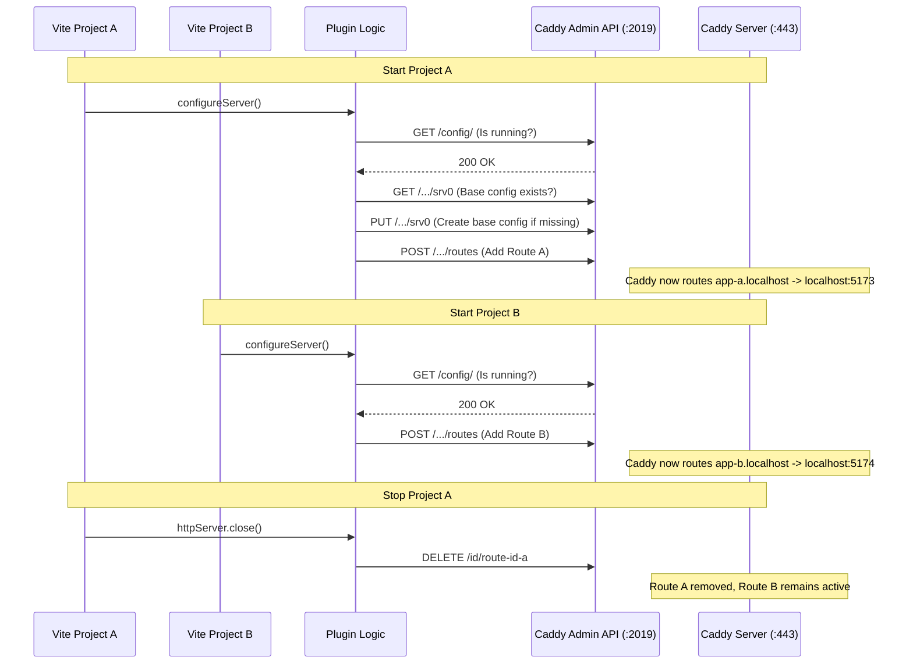

# Architecture: Shared Caddy Proxy for Multiple Vite Instances

This document outlines the architecture of `vite-plugin-multiple-caddy`, designed to allow multiple Vite development servers to run simultaneously using custom local domains and HTTPS, sharing a single Caddy reverse proxy instance.

## Core Problem
The original plugin spawned a dedicated `caddy run` process for every Vite instance. Since Caddy binds to port `443` (HTTPS) by default, trying to run a second Vite project resulted in an `EADDRINUSE` error.

## Solution Overview
Instead of spawning a process per instance, this plugin adopts a **Client-Server** model where:
1.  **Server**: A single, shared background Caddy instance listens on port 443.
2.  **Client**: Each Vite plugin instance acts as an API client, dynamically injecting and removing routing rules via Caddy's [Admin API](https://caddyserver.com/docs/api).

## Architecture Diagram



## Detailed Component Workflow

### 1. Initialization & Validation
When a Vite server starts, the plugin first verifies if the `caddy` CLI is installed.

### 2. Caddy Daemon Management
The plugin checks if Caddy is running by pinging `http://localhost:2019/config/`.
- **If Running**: Proceeds to configuration.
- **If Stopped**: Executes `caddy start` (daemon mode) and waits for the API to become responsive.

### 3. Base Configuration (`srv0`)
Before adding specific routes, the plugin ensures the "Base Config" exists. It checks `/config/`, then creates a standard HTTP server listening on `:443` if one doesn't exist.

### 4. Dynamic Route Injection
For every Vite instance, a unique `routeId` is generated. The plugin constructs a specific Caddy JSON route object:

```json
{
  "@id": "vite-proxy-<timestamp>-<random>",
  "match": [{ "host": ["my-repo.my-branch.localhost"] }],
  "handle": [{
    "handler": "subroute",
    "routes": [{
      "handle": [{
        "handler": "reverse_proxy",
        "upstreams": [{ "dial": "localhost:5173" }]
      }]
    }]
  }],
  "terminal": true
}
```

This JSON is `POST`ed to the Caddy API (`/config/apps/http/servers/srv0/routes`). This allows Caddy to reload its configuration instantly without dropping connections.

### 5. TLS Automation (when `domain` or `baseDomain` is set)
When a custom domain is used, the plugin creates a TLS automation policy with Caddy's internal issuer so HTTPS works for non-`.localhost` domains.

### 6. Cleanup
The plugin listens to the Vite DevServer's `close` event and process signals (SIGINT/SIGTERM). When triggered, it sends `DELETE` requests to the Caddy API using the specific `@id` of the route (and TLS policy if created). This removes *only* the configuration for that specific project, leaving other running projects (and Caddy itself) untouched.

## Data Flow

1.  **Incoming Request**: Browser requests `https://repo.branch.localhost` (resolves to 127.0.0.1 automatically via the `localhost` domain).
2.  **Caddy Listener**: Caddy receives request on port 443.
3.  **Matcher**: Caddy iterates through active routes. Matches `host: ["repo.branch.local"]`.
4.  **Reverse Proxy**: Request is forwarded to `localhost:5173` (HTTP).
5.  **Vite Server**: Vite processes the request and returns the asset/HTML.
6.  **TLS Termination**: Caddy handles the SSL encryption (managing self-signed certs automatically) and responds to the browser.
